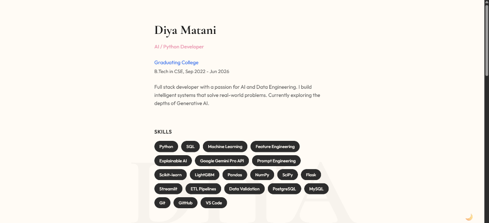

# Diya.Verse 🌌

A minimal, single-page portfolio website designed with a focus on **compactness** and **feminine aesthetics**.

The site features a **Vertical Micro-Portfolio** layout (inspired by *Akhil World*) that presents all key information—Bio, Skills, Experience, and Projects—in a single, focused column for a distraction-free reading experience.


*(Note: Add a screenshot of your site here)*

## ✨ Key Features

*   **Vertical "Micro" Layout**: A narrow, centered column (max-width 600px) that flows naturally.
*   **Dark / Light Mode**: Built-in theme toggler (Sun/Moon) for personalized viewing.
*   **Interactive Cards**: 
    *   **Projects Grid**: 2x2 layout with direct links to **GitHub** and **Live Outputs** (Streamlit apps).
    *   **Experience**: Concise, timeline-style work history.
    *   **Skills**: Minimalist chips for quick scanning.
*   **Aesthetic Typography**: Pairing **Cormorant Garamond** (Serif) with **Outfit** (Sans-serif) for an elegant look.
*   **Responsive**: Fully optimized for mobile and desktop screens.

## 🛠️ Tech Stack

*   **Frontend**: [React](https://reactjs.org/) + [Vite](https://vitejs.dev/)
*   **Styling**: Pure CSS3 (CSS Variables for Theming & Glassmorphism)
*   **Deployment**: [Vercel](https://vercel.com/)

## 🚀 Getting Started

To run this project locally:

1.  **Clone the repository**
    ```bash
    git clone https://github.com/diya-matani/Diya.verse.git
    cd Diya.verse
    ```

2.  **Install Dependencies**
    ```bash
    npm install
    ```

3.  **Run Development Server**
    ```bash
    npm run dev
    ```

## 📂 Project Structure

```
src/
├── components/      # Modular sections (Hero, Projects, Contact, etc.)
├── data/           # resume.js (Centralized content source)
├── index.css       # Global styles & Dark Mode variables
└── App.jsx         # Main layout & Theme logic
```

## 👩‍💻 Author

**Diya Matani**  
*AI / Python Developer*  
[LinkedIn](https://linkedin.com/in/diya-matani) • [GitHub](https://github.com/diya-matani)

---
*© 2025 Diya Matani. Built with code & creativity.*
